<h1 align="center">iFood Clone UI</h1>

## 🎥 Gifs

<div style="display:flex">
  
  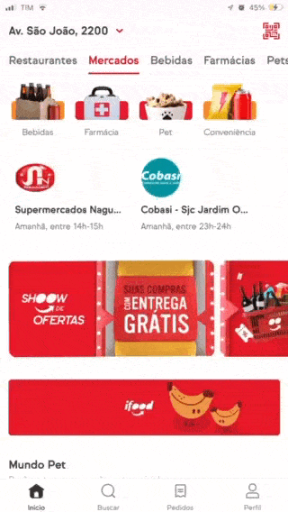
  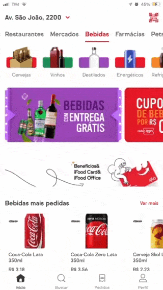
</div>

<div style="display:flex; margin-top:16px">
  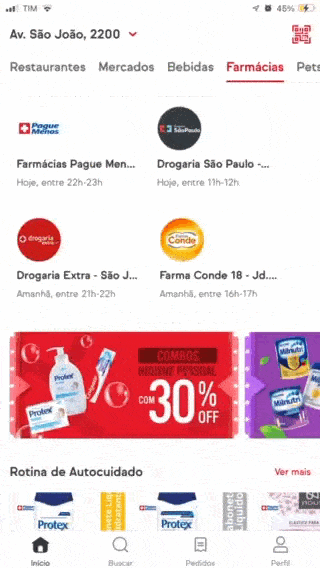
  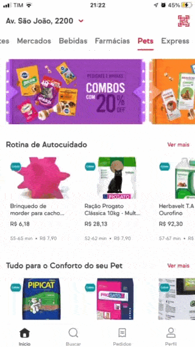
  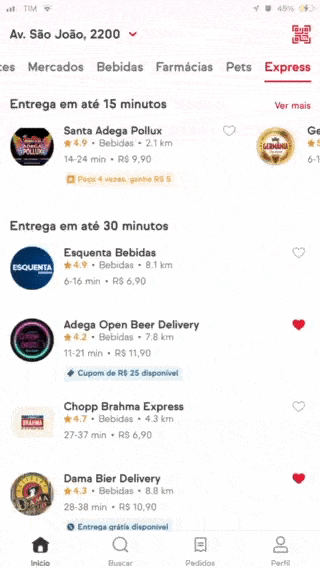
</div>
<br/>

## 📸 Imagens
<div style="display:flex">
  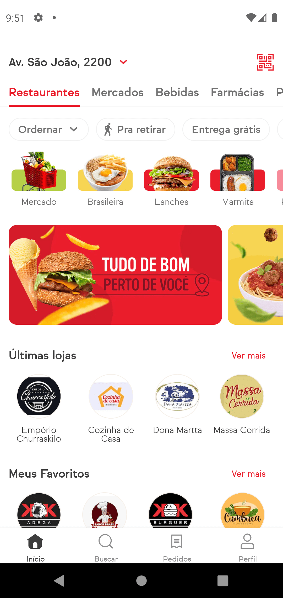
  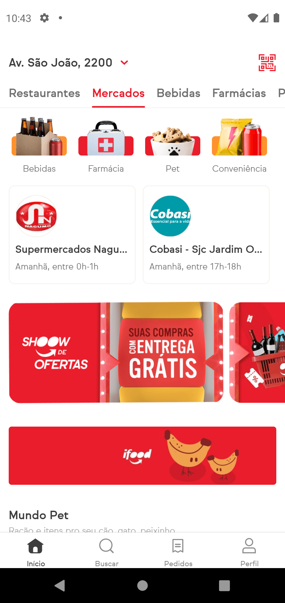
  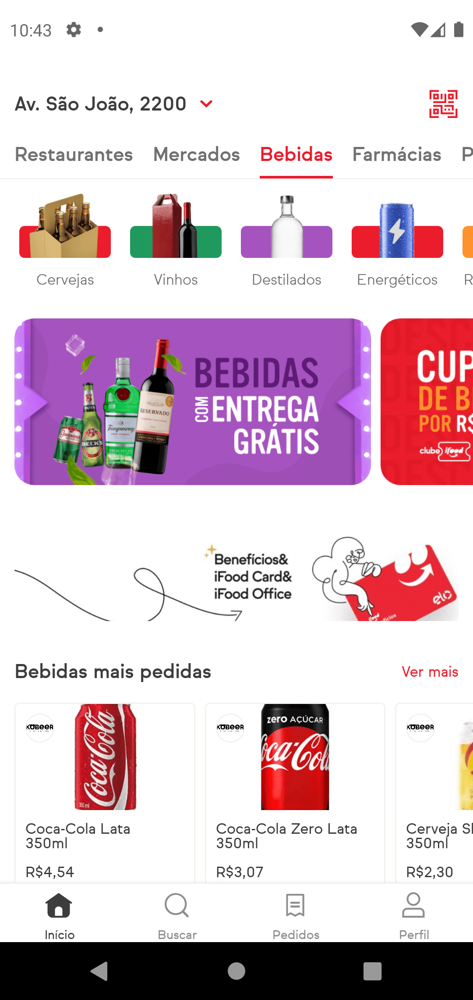
</div>

<div style="display:flex; margin-top:16px">
  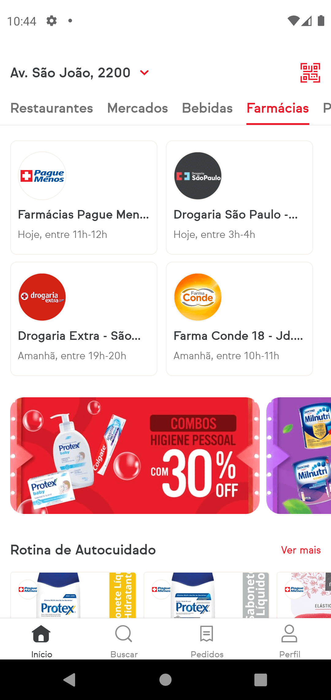
  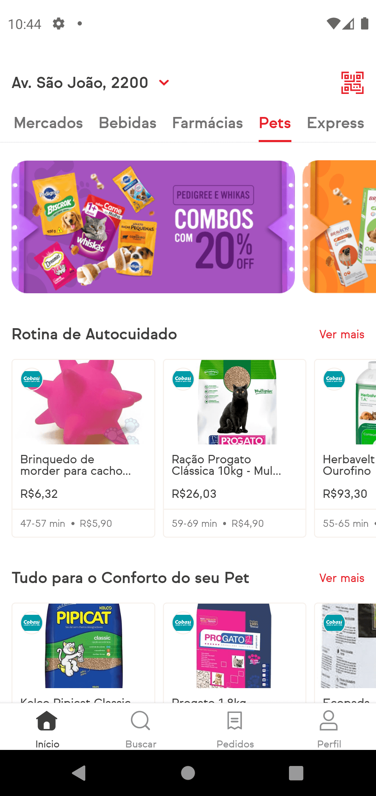
  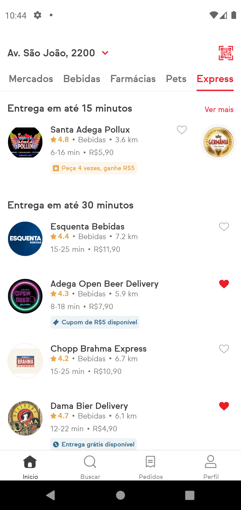
</div>
<br/>

## 💻 Projeto

Clone da interface do aplicativo iFood, para esse projeto foi utilizado o conceito de **Atomic Design** para o desenvolvimento dos componentes e os commits foram realizados utilizando o padrão de **Conventional Commits**.

## 🎯 Objetivos

O objetivo principal do projeto foi de aprender as particularidades, componentes e estilização no React Native em comparação com o React.

## 🖥️ Telas 

- [x] Início
  - [x] Restaurantes
  - [x] Mercados
  - [x] Bebidas
  - [x] Farmácias
  - [x] Pets
  - [x] Express
- [ ] Busca
- [ ] Pedidos
- [ ] Perfil


## ✨ Tecnologias
- React Native
- Typescript
- Expo
- React Native Svg e Svg Transform
- Expo Font
- React Navigation Native
- React Navigation Bottom Tabs
- React Native Gesture Handler
- React Native Reanimated
- Eslint
- Prettier
- Husky


## 🔖 Layout

O layout seguido foi baseado na versão web e do aplicativo para iOS do iFood, então por esse motivo os valores de tamanhos e espaçamentos são aproximados.


## 🤔 Observações

É importante notar que a pasta de  `assets` dentro da pasta `src` não foi disponibilizada para o repositório do Github pois contém todos os arquivos de imagens de lojas, produtos, ícones, banners e fontes utilizadas pelo próprio iFood em sua aplicação. 

Por esse motivo, eu como desenvolvedor não possuo nenhum tipo de direito sobre esse conteúdo e conclui que era melhor não disponibilizar tal conteúdo aberto para o público. 

Recomendo que se quiser reproduzir o mesmo comportamento, acesse o site do iFood e baixe esses recursos diretamente do site deles ou utilize outros semelhantes.

## ⌨️ Executando o projeto

Utilize um dos seguintes comandos para instalar as dependências do projeto:

```cl
yarn
```
```cl
npm install
```

Em seguida, utilize o seguinte comando para iniciar o projeto:

```cl
expo start
```

Após isso, é possível executar o projeto em um dispositivo físico real (necessário possuir o Expo Go instalado) escaneando o QR Code. Outra opção é executar o projeto em um simulador (Android ou iOS), digitando no *console* ou escolhendo a opção na aba aberta do Expo no browser.